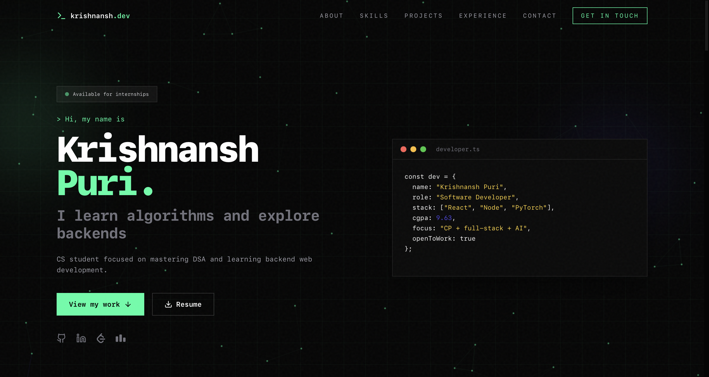
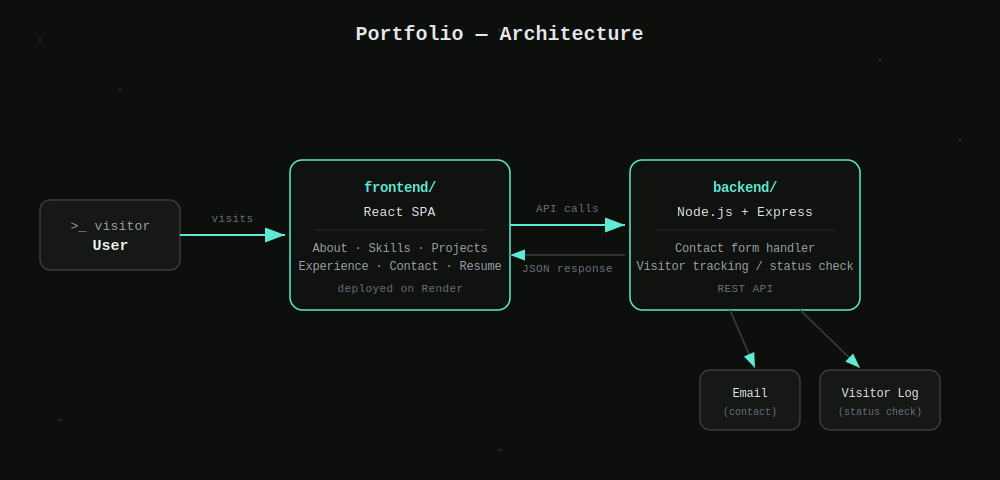

# Hey, this is my portfolio 👋

I'm Krishnansh Puri, a CS student focused on mastering DSA and exploring backend web development. This repo is the source code for my personal portfolio — where I show who I am, what I've built, and how to reach me. It's a full-stack app: a React frontend and a Node.js/Express backend handling the contact form and visitor tracking.

**Live site:** [portfolio-frontend-7imo.onrender.com](https://portfolio-frontend-7imo.onrender.com)



## What's inside

- **About** — a bit about who I am
- **Skills** — the tools and technologies I work with
- **Projects** — things I've built
- **Experience** — where I've worked and learned
- **Resume Download** — grab my resume directly
- **Contact Form** — reach out to me straight from the site

## Tech Stack

**Frontend**
- React

**Backend**
- Node.js
- Express

I also work with PyTorch and AI on the side — competitive programming, full-stack, and AI are my main areas of focus right now.

## Architecture



## Getting Started

### Prerequisites

- Node.js and npm installed

### Installation

1. Clone the repo
   ```bash
   git clone https://github.com/KrishnanshPuri/Portfolio.git
   cd Portfolio
   ```

2. Install backend dependencies
   ```bash
   cd backend
   npm install
   ```

3. Install frontend dependencies
   ```bash
   cd ../frontend
   npm install
   ```

### Running Locally

1. Start the backend server
   ```bash
   cd backend
   npm start
   ```

2. Start the frontend
   ```bash
   cd frontend
   npm start
   ```

The frontend will typically run on `http://localhost:3000` and the backend on its configured port.

## Deployment

This project is deployed on [Render](https://render.com).
